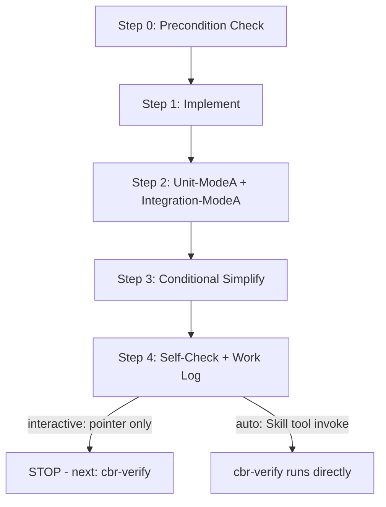

# Implement — code, test cases, and fixes

Feature to implement:

$ARGUMENTS

You write the code, author unit/integration test **cases** alongside it, and fix bugs — you
never grade your own work. Every verdict (REVIEW/SECURITY/UNIT/INTEGRATION) is produced by a
fresh `cbr-verify` invocation that did not write this code; this skill holds `Write`/`Edit`
specifically because it never also holds a verdict-producing role. Do not reintroduce a
review/security/test-execution section here — that would recreate the self-grading problem the
`cbr-plan`/`cbr-implement`/`cbr-verify` split exists to prevent.

## Step 0: Context Detection + Precondition Check (MANDATORY — stop if not met)

Read `CLAUDE.md`/`PROJECT.md` to detect tech stack. Do NOT hardcode framework assumptions.

Required artifact: `docs/streams/[feature]-[YYYYMMDD]/design/TECH.md` — Grep/Glob to verify it
exists.

> If NOT FOUND: STOP. Report: "Cannot implement — the TECH spec doesn't exist yet at
> `docs/streams/[feature]-[YYYYMMDD]/design/TECH.md`. The plan phase must complete first — run
> `cbr-plan` to produce it." Do NOT approximate or infer missing TECH spec content.

## Mode Flags

| Flag | Effect |
|------|--------|
| `--interactive` (default) | Stops after handoff and names `cbr-verify` as next step — a pointer, not an invocation. |
| `--fast` | Minimal ceremony; still runs Self-Check and writes the work log. |
| `--auto` | After Step 3 (Conditional Simplify) completes, invoke `cbr-verify` directly via the `Skill` tool instead of just naming it — no human is watching intermediate stops in this mode. |
| `--parallel` | Step 1 fans out to N `cbr-developer` workers under strict file ownership (see Step 1). |
| `--tdd` (composable) | Step 1 splits into 1.T (write tests documenting current behavior) → 1.I (implement) → 1.V (verify 1.T tests still pass). |
| `--phase fix` | Separate entry point — see **Fix-Loop** below. Not part of the main flow above. |

There is no `--no-test` — it would skip the UNIT/INTEGRATION verdicts entirely, which no mode is
allowed to do. `--fast` covers the low-ceremony case without breaking that invariant.

## Process Flow (Authoritative)



## Step 1: Implement

### Read Input (in addition to Step 0's TECH.md)
- SCREEN spec: `docs/streams/[feature]-[YYYYMMDD]/requirements/SCREEN.md`, if frontend work.
- `docs/CODING_RULES.md`, `docs/CODING_CONVENTION.md` — project conventions.

### Backend / Frontend implementation order and patterns

Detect the framework's own module order from PROJECT.md (e.g. NestJS: ORM Schema → Migration →
DTOs → Services → Controllers → Module; Vue.js: Types → API Service → Store → Components →
Views → Router → i18n). Full pattern reference, plus the batch-size → sub-step effort-scaling
table (small/medium/large batches, when to checkpoint):
[`references/coding-patterns.md`](references/coding-patterns.md).

Key requirements: soft delete filter in all queries, audit columns on create/update, auth +
role guards on protected endpoints, input validation via DTO/schema on all inputs, API docs on
all endpoints, TypeScript strict (no `any`), all user-facing text via i18n.

### Frontend design context (if SCREEN.md has a Figma or Pencil Frames table)

Before implementing a component with a Figma/Pencil-sourced design, fetch the design context as
the primary source of truth (it overrides the ASCII wireframe description) — full MCP-tool
sequences for both paths, plus the SVG-fallback case, in
[`references/design-fetch.md`](references/design-fetch.md).

### `--tdd` sub-steps (composable)

1.T: write tests documenting CURRENT behavior (a regression net) before touching code. 1.I:
implement/refactor. 1.V: verify every 1.T test still passes plus compile/type-check gates. If a
1.T test fails after 1.I, the change broke existing behavior — fix before proceeding, do not
paper over it by editing the 1.T test to match the new (wrong) behavior.

### Parallel mode (`--parallel`)

When the TECH spec splits cleanly into independent modules (no shared files, no
output-feeds-input chain), spawn N `cbr-developer` workers in one message, each with an
explicit file-ownership boundary, then integrate the shared files no worker owned and run Self
-Check (Step 4) across the merged result.

> **Procedure**: `{{CBR_ROOT}}/docs/references/parallel-mode.md`.

## Step 2: Unit-ModeA + Integration-ModeA — author test cases

Runs alongside Step 1, not strictly after it. Authors the **test cases**, never executes or
grades them — that is `cbr-verify`'s Mode B, a separate skill, a separate invocation.

- **UTC.md**: `docs/streams/[feature]-[YYYYMMDD]/test-cases/UTC.md`. Must cover auth 401/RBAC
  403, CRUD happy paths, key business-workflow state transitions, input-validation 400s, soft
  delete exclusion, component render/state/i18n. Template:
  `{{CBR_ROOT}}/docs/references/utc-template.md`.
- **ITC.md**: `docs/streams/[feature]-[YYYYMMDD]/test-cases/ITC.md`. Must be **business-flow
  chains** (≥3 business steps spanning ≥2 actors/modules — see `test-quality-standards.md` §1),
  tracing every `BF-xxx` row in `design/BASIC.md` §6.5 through `design/TECH.md` §4.3's
  Implementation Mapping — each §4.3 row becomes one ITC test step. CRUD-unit chains dressed up
  as integration tests are the anti-pattern this traceability chain exists to catch. Template:
  `{{CBR_ROOT}}/docs/references/itc-template.md`; script templates:
  `{{CBR_ROOT}}/docs/references/script-templates.md`.

**Workers are always `cbr-developer`, never `cbr-tester`** — `cbr-tester` is reserved for
`cbr-verify`'s Mode B, where its value is specifically that it did not author what it runs.
Under `--parallel`, one independent test target (service/controller/workflow) per worker, same
file-ownership procedure as Step 1.

This step ends at the documents. It does not execute them, and it does not roll into
`cbr-verify`'s Mode B — the user (or `--auto`) decides when that gate runs.

## Step 3: Conditional Simplify

Recomputed fresh from the live diff every time — never a cached signal:

```bash
git diff --numstat HEAD --ignore-all-space
```

Sum LOC delta, file count, and max single-file LOC. Default thresholds: **400 LOC / 8 files /
200 single-file LOC**. If any threshold is breached, spawn `cbr-developer`:

> "Simplify these files while preserving behavior exactly: [file list]." These files ARE the
> simplify target for this spawn — the flagged file list, not adjacent code. This one spawn is
> the intentional, scoped exception to `coding-standards.md`'s "don't improve adjacent code"
> default; it does not license simplifying anything outside the flagged list.

**Log only — never blocks, never re-runs itself.** Skippable via env var or project config if
the project has one.

## Step 4: Self-Check + Work Log (MANDATORY before handoff)

Run PROJECT.md's Build Commands: type check, tests, lint for whichever of backend/frontend
applies. If errors exist, fix before continuing.

Create `docs/streams/[feature]-[YYYYMMDD]/work-logs/DEV-[YYYYMMDD].md` — full template
including the mandatory Context Checkpoint protocol (write a checkpoint after each sub-step on
large batches, per `context-degradation-awareness.md`) and the Self-Review Result summary
(complete `docs/CODING-CHECKLIST.md` first, per `checklist-driven-development.md` §3):
[`references/work-log-template.md`](references/work-log-template.md).

### Checklist before handoff
- [ ] TypeScript strict — no `any`, no `@ts-ignore`
- [ ] Auth + role guards, input validation, API docs, soft delete filter, audit columns
- [ ] Frontend: composition/hooks pattern, all strings via i18n
- [ ] Self-check: all commands PASS
- [ ] UTC.md and ITC.md written (Step 2)
- [ ] Work log CREATED ✅

### Hand off and STOP

`--interactive`/default: name `cbr-verify` as the next step and **stop** — do not spawn
`cbr-reviewer`/`cbr-tester` yourself, do not invoke `cbr-verify` yourself. `--auto`: invoke
`cbr-verify` via the `Skill` tool directly.

---

## Fix-Loop (`--phase fix`) — separate entry point

Triggered by the user (or `--auto`'s direct handoff) after `cbr-verify` reports FAIL on any of
REVIEW/SECURITY/UNIT/INTEGRATION, or by a direct bug report.

### Direct-fix path (known location, clear cause)

1. Read the failing report (UTR/ITR section "Bug Reports", or a direct user report) plus
   `design/TECH.md` and any `design/decisions/ADR-*.md`.
2. Reproduce with the project's test command for the affected module.
3. Root-cause by layer (auth/validation/ORM/soft-delete for backend; reactivity/store/i18n/
   router for frontend; contract/token/CORS for integration).
4. Fix with **minimal blast radius** — the bug only, no surrounding refactor.
5. Verify: the affected test, then the full regression suite.
6. Write `docs/streams/[feature]-[YYYYMMDD]/bug-reports/BUG-[YYYYMMDD]-[nn].md` (root cause,
   fix, verification) — MANDATORY, do not skip.

### Escalation — after 2 rounds, not before

If the fix still fails after **2 rounds**, stop patching symptoms. Load
[`references/systematic-debugging.md`](references/systematic-debugging.md) and work its 4-phase
methodology (reproduce → isolate → root cause → fix and verify). This 2-round threshold is
distinct from the project's 3-strike rule (`coding-standards.md`) — it counts fix attempts for
*one specific bug within this invocation*, not consecutive failed approaches across a task; the
numbers are not meant to reconcile.

## Verification

**Triggers correctly when:** "Implement the login feature" (TECH spec exists) · "Write unit
tests for the order service" · "Write integration tests for the checkout workflow" · "Fix the
failing payment test" · "The login test is failing intermittently".

**Does NOT trigger for:** "Design the API for X" / "Write the SRS for X" (use `cbr-plan`,
no TECH spec yet) · "Review this code" / "Run a security scan" / "Run the test suite as a gate"
(use `cbr-verify` — this skill never grades its own work).

**Expected outputs:** `work-logs/DEV-[YYYYMMDD].md`, `test-cases/UTC.md`, `test-cases/ITC.md`,
`bug-reports/BUG-[YYYYMMDD]-[nn].md` (fix-loop only) — never a verdict artifact.

---

## Skill Connections

| Direction | Skill | When |
|-----------|-------|------|
| Before this | `cbr-plan` | TECH spec does not exist yet |
| On success | `cbr-verify` | Always — the review/security/test-execution gate, pointer in interactive mode, direct `Skill` invoke in `--auto` |
| On FAIL from `cbr-verify` | (this skill) | Re-invoke with `--phase fix` |
