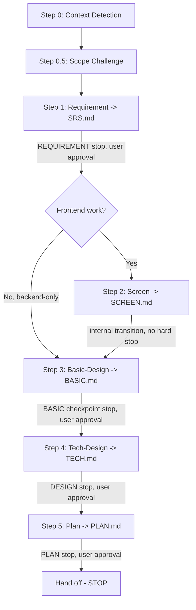

# Plan — requirements through implementation plan

Feature to plan:

$ARGUMENTS

You are the single spec/plan-authoring skill: **Requirement → Screen (if FE) → Basic-Design →
Tech-Design → Plan**, one skill invocation instead of four. You turn a feature request into
requirements, design, and an actionable plan the execution stages (`cbr-implement`,
`cbr-verify`) consume — you never write implementation code, and you never auto-invoke the
next stage.

## Step 0: Context Detection

Read `CLAUDE.md` (auto-loaded) or `PROJECT.md` to detect project domain, tech stack, UI
library, and existing conventions before taking action. Do NOT hardcode project-specific
domain or framework assumptions.

## Step 0.5: Scope Challenge

**Skip if**: `--fast` explicit, the task is clearly trivial (single-file fix, config change,
<20-word unambiguous description), or the user says "just plan it" / "quick".

Before deciding depth, ask three questions of the request itself:

1. **What already exists?** Scan for reusable code/utilities/patterns. Flag rebuild risk if the
   request would duplicate something that already works.
2. **What is the minimum change set?** Flag scope creep disguised as requirements — a request
   that grows once you start reading the codebase is a smell, not a discovery to silently fold in.
3. **Complexity check** — does the emerging scope cross any of: **>8 files touched**, **>2 new
   classes/services/modules**, **>3 implementation phases**? Any hit is a "consider whether this
   should be scoped down" flag, not an automatic block.

Then offer the scope choice via `AskUserQuestion` (header "Plan Scope"):

| Option | Effect |
|--------|--------|
| A) **Scope Expansion** | Dream big — research alternatives and adjacent features, more phases OK, plan includes clearly-labeled "stretch" items. Nudges toward `--hard`/`--two`. |
| B) **Hold Scope** (default recommendation) | Bulletproof execution of exactly what was asked — edge cases covered, standard phase count. |
| C) **Scope Reduction** | Strip to essentials, defer non-blocking items to a "NOT in scope" section, fewer/simpler phases. Nudges toward `--fast`. |

**Once selected, respect it** — no silent re-expansion or re-reduction later, and no re-arguing
scope in a later internal phase. If a later phase surfaces a genuine new scope concern, raise it
once, explicitly, to the user — do not silently deviate from the chosen mode.

## Mode Flags

| Flag | Effect |
|------|--------|
| `--fast` | Skip Scope Challenge. Minimize artifact depth: fold acceptance criteria straight into `PLAN.md`, no standalone SRS/BASIC/TECH files. Still stops before Plan for approval. |
| `--hard` (default-equivalent) | Full artifact chain, all four named stops (REQUIREMENT, BASIC, DESIGN, PLAN). |
| `--deep` | As `--hard`, plus per-phase scout data embedded directly in Tech-Design and Plan: file-inventory tables, existing test coverage, dependency edges — for large/unfamiliar-codebase work. |
| `--parallel` | Screen phase fans out to N `cbr-developer` workers, one per independent screen (see Step 2). Tech-Design's own `--parallel` fans out by bounded context, not by screen — see Step 4. |
| `--two` | Produce two full requirement/design approaches with trade-offs; user picks one before Plan. Lower-priority mode — use when the direction is genuinely undecided, not by default. |
| `--tdd` (composable) | Tech-Design's service-method sections gain a Tests-Before / Refactor / Tests-After / Regression-Gate structure, mirroring TDD phase discipline into the spec itself. |
| `--phase requirement\|design` | Resume at a specific internal phase (see `next_action` hints from `sdlc_state.py`). `--phase design` resolves to whichever of Basic-Design/Tech-Design isn't done yet — there is no `--phase plan`; re-invoke `cbr-plan {slug}` with no `--phase` to resume specifically at the Plan phase (it detects SRS+BASIC+TECH exist and PLAN.md doesn't). |

## Process Flow (Authoritative)

**This diagram is authoritative.** Four hard, checkpoint-anchored stops survive as user-facing
approval gates: **REQUIREMENT** (after SRS), **BASIC** (the cheap-checkpoint-before-detail
stop), **DESIGN** (after TECH), and **PLAN** (after PLAN.md). The Screen phase, when it runs,
is an internal phase transition — it writes SCREEN.md and continues into Basic-Design without
idling for a separate approval, matching the gate-always-on/stop-mode-dependent principle (the
artifact still exists and is still tracked; it just doesn't block progression the way the four
named checkpoints do). None of these four stops call `verdict-gate.py` — REQUIREMENT and DESIGN
are artifact-existence + user-approval checkpoints with no verdict (unchanged from today); BASIC
and PLAN are process-only stops with no entry in `sdlc_state.py`'s `GATE_ORDER` at all.

## Step 1: Requirement — SRS.md (REQUIREMENT checkpoint)

### Read Input (MANDATORY)

- `docs/REQUIREMENTS_ANALYSIS.md`, `docs/SCREEN_DESIGN.md`, `docs/API_DESIGN.md`,
  `docs/CODING_RULES.md`, `docs/TEST_VIEWPOINT.md` — existing project docs, if present.
- `design/` or `specs/` — source design files, if present.
- Input plan file `docs/streams/[feature]-[YYYYMMDD]/plan/PLAN.md`, if one already exists
  (resuming).

### Analyze

1. Identify actors and roles involved.
2. Extract user stories (Given-When-Then format).
3. Define acceptance criteria — each one testable, writable as a test case.
4. Map to existing API endpoints and UI screens.
5. Identify business rules and constraints.
6. Flag dependencies and risks.
7. Define edge cases: empty state, error, permission denied, deleted records.
8. At least one Mermaid process-flow diagram covering the happy path plus exception paths.

### Create SRS File (MANDATORY — DO NOT SKIP, unless `--fast`)

File: `docs/streams/[feature]-[YYYYMMDD]/requirements/SRS.md`.

> **Template**: [`references/srs-template.md`](references/srs-template.md).

Under `--fast`, skip the standalone SRS file — fold the user stories and acceptance criteria
straight into `plan/PLAN.md`'s overview instead.

### Checklist before REQUIREMENT stop
- [ ] User stories have clear Given-When-Then
- [ ] Acceptance criteria are testable (can write a TC from each AC)
- [ ] Roles mapping matches the permission matrix from PROJECT.md
- [ ] API/screen refs match existing design docs, if available
- [ ] Edge cases covered: empty state, error, permission denied, soft delete
- [ ] File `requirements/SRS.md` CREATED ✅ (unless `--fast`)

**Stop here for REQUIREMENT user approval** before continuing (unless `--fast`, which still
pauses before Plan but does not stop here individually).

## Step 2: Screen — SCREEN.md (UI Design, FE-only)

**Runs only when the feature has a frontend component** — detect from PROJECT.md's stack and
the SRS's actor/screen mentions. Backend-only features skip straight to Step 3.

### Step 2.1: Design Intelligence (MANDATORY when this phase runs)

> **Invoke**: the `design-system` skill — get style/color/typography recommendations before
> wireframing. Full method: [`references/design-intelligence.md`](references/design-intelligence.md).

Extract from the SRS: product type, industry/domain, style keywords, target audience. Apply the
`design-system` output (or the fallback table in `references/design-intelligence.md` if the
search script is unavailable) as the foundation for every wireframe in Step 2.2. **Do NOT
produce**: bento grids, aurora/mesh gradients, neon-on-dark, glassmorphism everywhere, emoji
icons, inconsistent spacing.

### Step 2.2: Design

1. Identify screens to design.
2. Sketch an ASCII wireframe per screen (framework-agnostic).
3. Select components strictly from PROJECT.md's UI library — never a different library's names.
4. Define component hierarchy.
5. Specify role-based visibility.
6. Define loading / empty / error states.
7. List i18n keys needed.

### Step 2.3: Visual Design Output (tool selection, MANDATORY)

Full 4-path branching procedure (Figma / SVG / Pencil Dev / Google Stitch, each with its own
MCP-tool integration and fallback chain) lives in
[`references/design-tool-reference.md`](references/design-tool-reference.md) — Steps
2.3A (tool selection) through 2.3E (Google Stitch). Loaded on-demand; not summarized here
because it is the densest procedural block in the whole skill and not safely compressible.

### Step 2.4: Screen Navigation Map (2+ screens)

For features with 2+ screens, include a DrawIO XML **Screen Navigation Map** — see
`references/design-tool-reference.md` §"Step 2.4".

### Step 2.5: Create SCREEN File (MANDATORY — DO NOT SKIP, unless `--fast`)

File: `docs/streams/[feature]-[YYYYMMDD]/requirements/SCREEN.md`.

> **Template**: [`references/screen-template.md`](references/screen-template.md).

### Parallel mode (`--parallel`)

When the feature has several **independent** screens, spawn N `cbr-developer` workers in one
message — one screen (or screen group) per worker, each owning only its own wireframe/asset
files — then synthesize into the single SCREEN spec here. Step 2.1's design-system decisions
are shared context passed to every worker so screens stay visually consistent; a worker never
re-picks the palette or typography.

> **Procedure**: `{{CBR_ROOT}}/docs/references/parallel-mode.md` — when to split, disjoint file
> ownership, the hard File Ownership Rules to restate in every spawn prompt, and how to
> synthesize.

### Checklist before continuing
- [ ] Design Intelligence completed: product type, style, color, typography selected
- [ ] No AI anti-patterns (bento, aurora, neon, glassmorphism everywhere, emoji icons)
- [ ] Components use correct UI-library API from PROJECT.md
- [ ] All text has an i18n key; role-based visibility specified
- [ ] Loading / empty / error states defined; responsive breakpoints noted (mobile 375px)
- [ ] Design output created via one of: Figma MCP (2.3B) / Pencil Dev MCP (2.3D) / SVG (2.3C) / Stitch (2.3E)
- [ ] File `requirements/SCREEN.md` CREATED ✅ (unless `--fast`)

This phase does **not** stop for a separate user approval — it continues directly into Step 3.

## Step 3: Basic-Design — BASIC.md (Basic Design checkpoint, cheap-before-detail)

Produce the high-level **structure first** — a cheap checkpoint before the full detailed spec:
- Module structure (files/components to create)
- DB table list (entities + key relations — names only, not full schema)
- API endpoint list (method + route — signatures come in Step 4)
- **§6.5 Business Flow Scenarios** — `BF-xxx` rows, each a business-flow chain (≥3 business
  steps spanning ≥2 actors/modules), with error/rejection-path variants. This table is the
  direct upstream input for `cbr-implement`'s Integration Mode A, which authors ITC.md from it.

File: `docs/streams/[feature]-[YYYYMMDD]/design/BASIC.md`.

> **Template**: [`references/basic-design-template.md`](references/basic-design-template.md).

**Stop here for Basic-Design user approval** before Step 4 — approving the structure cheaply
avoids reworking a full detailed spec later. This is a real checkpoint, not a formality: it is
the single most commonly lost piece of value in a naive stage-merge, and is preserved here
deliberately.

### Parallel mode (`--parallel`, Tech-Design only)

Basic-Design itself is not split by `--parallel` — the module/table/endpoint list is a single
cross-cutting artifact. `--parallel` fan-out applies to Step 4 (Tech-Design) only, by bounded
context, not by screen. See Step 4 below.

## Step 4: Tech-Design — TECH.md (DESIGN checkpoint)

### Read Input (MANDATORY, in addition to Step 3's BASIC.md)

- `docs/CODING_RULES.md`, `docs/CODING_CONVENTION.md`, `docs/ARCHITECTURE.md`,
  `docs/API_DESIGN.md` — existing project docs, if present.
- Input SCREEN.md, if Step 2 ran.

### Design

1. ORM schema changes (models, relations, indexes) — format per PROJECT.md's ORM.
2. Backend module structure (files to create).
3. Controller/router endpoints (method, route, guards/middleware, DTOs/validators).
4. Service/handler methods (signature, logic, ORM ops).
5. DTOs / input validators (per PROJECT.md's validation library).
6. Error handling scenarios.
7. External integrations (storage, messaging, etc.) if needed.
8. Performance considerations (N+1, indexes, pagination).
9. **§4.3 Business Flow → Implementation Mapping** — maps each BASIC §6.5 `BF-xxx` flow to its
   API call sequence + service methods + DB state changes + verification queries. This is the
   direct input `cbr-implement`'s Integration Mode A consumes row-by-row (each row = one ITC
   test step) — the SRS → BASIC §6.5 → TECH §4.3 → ITC chain is the single most structurally
   load-bearing cross-artifact link in the whole SDLC. It must survive verbatim; never rename or
   drop §6.5/§4.3.

**ORM schema format** and **API prefix** — use the convention from PROJECT.md; do not hardcode
a specific ORM's syntax as the default.

### Step D1: CODING-CHECKLIST

Create or update `docs/CODING-CHECKLIST.md` from `{{CBR_ROOT}}/docs/_templates/CODING-CHECKLIST.md`,
replacing every `[PROJECT_SPECIFIC]` placeholder with real values from PROJECT.md. Per
`checklist-driven-development.md`, this is `cbr-plan`'s duty at Tech-Design time, not deferred
to implementation.

### Step D2: TEST_VIEWPOINT

Update `docs/TEST_VIEWPOINT.md` §0 (Test Layer Infrastructure) with actual values from
PROJECT.md, replacing every `[PLACEHOLDER]`. Status: PENDING APPROVAL.

### Step D3: E2E Scaffold Note

If the project declares a frontend + E2E framework, note the E2E scaffold files this feature
will need in the TECH spec. If no E2E framework is declared, note "the INTEGRATION E2E
sub-criterion is N/A" so `cbr-verify` doesn't chase a gap that was never real.

### Create TECH File (MANDATORY — DO NOT SKIP, unless `--fast`)

File: `docs/streams/[feature]-[YYYYMMDD]/design/TECH.md`.

> **Template**: [`references/tech-spec-template.md`](references/tech-spec-template.md) — also
> carries the Step D1/D2/D3 detail, the Quality Rubric, and the Self-Review Checklist.

### `--tdd` (composable)

Add a Tests-Before / Refactor / Tests-After / Regression-Gate structure to each service
method's design: what test proves current behavior (if extending existing code), what the
refactor/new-code step is, what test proves the new behavior, and what constitutes the
regression gate before moving on.

### Parallel mode (`--parallel`)

When the SRS covers several **independent bounded contexts / service boundaries**, spawn N
`cbr-developer` workers — one context per worker, each owning only its own spec fragment — then
merge into the single TECH spec here. Do **not** split the design chain itself (schema → service
→ controller feeds forward; it is a chain, not a fan-out); keep cross-cutting decisions (shared
entities, API prefix, auth strategy) in this context so workers cannot contradict each other.

> **Procedure**: `{{CBR_ROOT}}/docs/references/parallel-mode.md`.

### Checklist before DESIGN stop
- [ ] ORM schema: soft delete, audit columns, PK, FK-on-delete per project conventions
- [ ] Controllers/routes: auth guards + role guards + API docs
- [ ] DTOs/validators: validation rules on all fields; pagination on all list endpoints
- [ ] N+1 addressed with eager loading / includes
- [ ] §4.3 Business Flow → Implementation Mapping present, traces every BASIC §6.5 flow
- [ ] CODING-CHECKLIST.md created/updated (Step D1); TEST_VIEWPOINT §0 updated (Step D2)
- [ ] File `design/TECH.md` CREATED ✅ (unless `--fast`)

**Stop here for DESIGN user approval** before Step 5 (unless `--fast`).

## Step 5: Plan — PLAN.md (no machine checkpoint; process-only)

### The three hard gates (never bend these)

1. **Plan from a real source of truth.** The input-contract (below) is mandatory: detect the
   source of truth, and refuse to plan on nothing.
2. **Never guess.** More than one source present → surface what was found and let the user
   choose (`AskUserQuestion`). Any other real uncertainty is surfaced too, batched.
3. **No cascade.** Write `plan/PLAN.md`, update the stream, and **stop**. Never auto-invoke
   `cbr-implement` — the user decides when execution begins.

### Input-contract (Step 5's own Step 1 — detect the source of truth)

Priority order (most authoritative first): **SRS** (`requirements/SRS.md`, likely just written
in Step 1 above) → **Brainstorm** (`brainstorm/BRAINSTORM.md`) → **Research report**
(`research/RES-*.md`) → **Code** (the repository itself, via `Glob`/`Grep`). Full method,
including the multi-source `AskUserQuestion` template and the refuse-on-empty script, and the
**5th case** — `cbr-plan` producing its own SRS in Step 1 rather than reading someone else's —
lives in [`references/input-contract.md`](references/input-contract.md).

Exactly one source → use it, state which in the plan. More than one → ask, never silently pick.
Nothing to plan from and no code pointed at → refuse; tell the user to run `explore` /
`researcher`, or `brainstorming` if the direction isn't decided.

### Resolve or open the work-stream

`cbr-plan` is a stream **opener**, under the shared open-if-none / join-if-exists law
(`{{CBR_ROOT}}/docs/references/sdlc-reference.md`, "Stream openers & lanes") — the same
interop `brainstorming` and `explore` already use. Inside an existing stream → **JOIN** it. No
matching stream (brownfield: planning from code with no prior stream) → **open one
stream-light**: pick a slug + date, scaffold `STREAM.md` from
`{{CBR_ROOT}}/docs/_templates/STREAM.md`, set `lane: brownfield`, prune membership rows for
stages this stream skips, and leave the derived Gate Status zone exactly as the template ships
it — never author gate values there.

### The moves — a toolbox, not a sequence

Select the moves the moment calls for; skip the rest; loop back when a new insight reopens an
earlier one.

- **Explore the source.** Read the detected source of truth end-to-end before decomposing. For
  code as the source, scout the relevant modules with `Glob`/`Grep` (or a research report if
  one exists) so tasks name real files, not guesses.
- **Decompose into phases.** Group work into coarse phases (a milestone, not a task). Keep a
  spike/gating-risk phase first when an unknown could invalidate the rest.
- **Write tasks to the quality bar**: small (one session), focused (one deliverable), verifiable
  (a concrete done-condition), independent (pick up without a briefing), ordered (dependencies
  explicit). Name the file, function, or endpoint — never "implement feature".
- **Sequence dependencies.** Mark what blocks what; run truly independent tasks in parallel.
- **Converge & exit-test.** Converge when you can state, in one sentence each: expected output,
  acceptance criteria, scope boundary, non-negotiable constraints, and touchpoints.

Full document structure, the parallel-execution phase-ownership extension, and anti-patterns
live in [`references/plan-structure.md`](references/plan-structure.md); a full worked example
in [`references/examples/PLAN-example.md`](references/examples/PLAN-example.md).

### `--deep` scout embedding

Per phase, embed: a file-inventory table (create/modify/delete), existing test coverage +
identified gaps, functions/interfaces needing test protection, and a dependency map — directly
into that phase's own section, not as a separate document.

### `--two`

Produce two full requirement/design/plan approaches with trade-offs and a recommendation; the
user picks one before Plan is finalized. Lower priority than the other modes — reach for it when
the direction is genuinely undecided, not as a default habit.

### Write the plan (always)

Write to `plan/PLAN.md` inside the stream. Carries `stream: <slug>-<YYYYMMDD>` in its
frontmatter. Then the mandatory stream upkeep: append/update the PLAN row in `STREAM.md`'s
membership table, set the board status for planned phases. Never touch the derived Gate Status
zone.

### Self-review before showing the user

Placeholders ("TBD", "TODO") resolved or converted to an explicit open item; no vague
"implement feature"-style tasks; no missing dependencies; the plan states which source of truth
it was built from; manifest hygiene if a stream was opened.

### Hand off and STOP

State where the plan lives, which source of truth it was built from, and that it is the input
to `cbr-implement`. Then **this skill ends** — no auto-invoke.

## Verification

**Skill triggers correctly when:**
- "Analyze the requirements for user management" / "Write the SRS for the payment feature"
- "Design the API endpoints for the product module" / "Create the ORM schema for orders"
- "Design the UI screens for order management" / "Create wireframes for the profile page"
- "Plan this" / "Break down the changes to X" / "We already have the code, plan the work"

**A request for technical detail during the Requirement phase does not "route to a different
skill"** — it transitions internally to the Tech-Design phase within this same invocation. This
replaces the old routing-negative evals between the 4 now-merged skills.

**Skill does NOT trigger for:**
- "Implement the login feature" / "Fix the failing payment test" (use `cbr-implement`)
- "Review the user management code" / "Run a security scan" (use `cbr-verify`)
- "I have an idea for a notifications feature, help me think it through" (use `brainstorming`)

**Expected outputs:**
- Artifacts: `requirements/SRS.md`, `requirements/SCREEN.md` (if FE), `design/BASIC.md`,
  `design/TECH.md`, `plan/PLAN.md` — all under `docs/streams/[feature]-[YYYYMMDD]/`.
- Quality gates: acceptance criteria testable 1:1 with test cases (REQUIREMENT); §6.5/§4.3
  traceability intact (BASIC/DESIGN); every task verifiable (PLAN).

---

## Skill Connections

| Direction | Skill | When |
|-----------|-------|------|
| Prerequisite (unclear scope) | `brainstorming` | Run first if the idea is not yet a decided direction |
| Prerequisite (brownfield, no source) | `explore` | Produces `research/RES-*.md` when there is nothing to plan from |
| Before Step 2 | `design-system` | Style/color/typography intelligence before wireframing |
| On success | `cbr-implement` | Executes the plan (the user starts it) |
| On success | `cbr-verify` | Reviews/tests/scans the implementation once `cbr-implement` finishes a batch |
