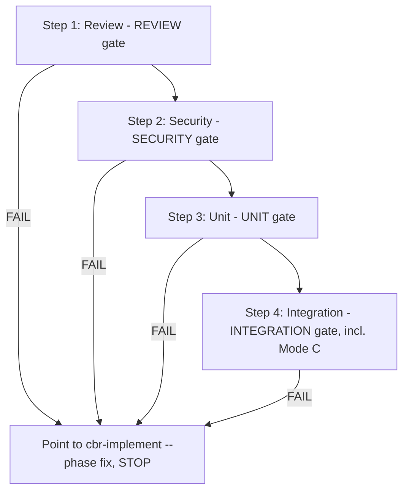

# Verify — review, security scan, and test execution (fresh eyes, no Write)

Feature to verify:

$ARGUMENTS

**This skill cannot write or edit a single file.** That is not a policy choice enforced by
prose — it is the `allowed-tools` grant above, and it is the entire reason this exists as a
separate skill from `cbr-implement` rather than a phase inside it. Every one of the four gate
phases below assembles the criteria, then spawns a **fresh** `cbr-reviewer` or `cbr-tester` — an
agent that did not write the code under test — to do the actual grading and write the verdict
artifact. If you ever find yourself about to grade code yourself or patch a file to make a gate
pass, stop: that is precisely the self-grading failure mode this skill's tool grant makes
impossible. Any edit to this `SKILL.md` that widens `allowed-tools` to include `Write`/`Edit`
is a regression, not a feature.

## Mode Flags

| Flag | Effect |
|------|--------|
| `--interactive` (default) | Stops after every internal phase for user approval — matches today's per-skill stop cadence. |
| `--fast` | Minimizes intermediate reporting; still runs every verdict. |
| `--auto` | Runs all four verdicts unconditionally; stops the user only when a **risk trigger** fires (see below) — never silently skips a stop on a high-risk change, never skips a verdict on a low-risk one. |
| `--phase review\|security\|unit\|integration` | Run one phase standalone (e.g. a security-only audit) instead of the full sweep. |

**No `--parallel`** — nothing here writes code, so there is no file-ownership fan-out to make.
**No `--tdd`** — not applicable to a grading-only skill. **No mode ever skips a verdict** — this
is fully achievable here (unlike the dropped `cbr-implement --no-test`) because this skill has
no non-gate work to skip past; every invocation exists to produce exactly one of the four
verdicts.

### `--auto` risk triggers (gate the STOP, never the verdict)

`--auto` still stops the user, even mid-sweep, when the change touches: **auth**, **secrets**,
**payments**, **DB schema/migrations**, **a public/exported API contract**, **CI/deploy/release/
production config**, or a **destructive filesystem operation**. A large diff is its own trigger
regardless of domain. On any FAIL, `--auto` also always stops (see Fail Handling) — auto-approval
only ever applies to a clean PASS on a low-risk change.

## Process Flow (Authoritative)



Each phase is independently invocable via `--phase` (e.g. a standalone security audit) or run as
the full sweep in order above. Every phase ends in a user gate (`--interactive`) or a risk-trigger
check (`--auto`) — never a silent pass-through to the next phase.

## Step 1: Review — REVIEW gate

### Precondition
Implementation code files exist (Glob/Grep) and, preferably,
`docs/streams/[feature]-[YYYYMMDD]/work-logs/DEV-*.md` (or `DEV-B[n].md` in batch mode) names
them. If no implementation is found: STOP — "Cannot review — no implementation found. Run
`cbr-implement` first."

### Assemble the checklist (this skill owns the criteria, not the verdict)
Security (CRITICAL — any finding blocks): auth guards, RBAC correctness, input validation via
DTO/schema, parameterized queries only, no hardcoded secrets, file-upload validation, scope
isolation. Correctness: matches TECH spec, edge cases, language strictness. Framework standards
(backend and frontend) per PROJECT.md. Full tech-lead dimension list:
[`references/leader-review-checklist.md`](references/leader-review-checklist.md).

### Verdict rubric — hand this to the reviewer **verbatim**

| Condition | Verdict |
|-----------|---------|
| Any Critical finding | FAIL |
| 3+ Major findings | FAIL |
| 1-2 Major findings | PASS (fix before merge) |
| Only Minor | PASS |

The validator (`verdict-gate.py`) enforces only the hard floor — `decision: PASS` and zero
Critical. It does **not** count Majors, so **the "3+ Major → FAIL" rule lives entirely in the
spawned reviewer's judgment** — it must appear in the spawn prompt verbatim, every time, or the
rule silently stops applying. Full per-gate blocking asymmetry:
`{{CBR_ROOT}}/docs/references/severity-vocabulary.md`.

### Spawn, validate, gate

Spawn one `cbr-reviewer` (single `Agent` call) carrying: scope (exact files from the work log —
batch-scoped in batch mode), the TECH spec + coding-rules paths, the checklist above, the rubric
table verbatim, and instructions to assume the code was AI-written — look for what breaks, cite
`file:line` on every finding. Outputs, both mandatory: `reviews/REVIEW-[YYYYMMDD].md` (template:
[`references/review-output-template.md`](references/review-output-template.md)) and
`reviews/VERDICT-REVIEW.json` (`gate: "REVIEW"`, `producedBy: "cbr-reviewer"`, `verification: []`
— a reviewer runs no commands).

```bash
python "{{CBR_ROOT}}/hooks/verdict-gate.py" --gate REVIEW --artifact docs/streams/[feature]-[YYYYMMDD]/reviews/VERDICT-REVIEW.json
```

Exit 0 → report PASS + any open Major/Minor findings, **stop**. Exit 2 or `decision: FAIL` →
see **Fail Handling** below.

## Step 2: Security — SECURITY gate

Runs the full OWASP checklist and **always** produces a verdict via a spawned `cbr-reviewer` —
there is no separate "just audit, no gate" mode today. (A genuinely standalone audit that writes
a distinctly-named `security/AUDIT-<date>.md`, never `VERDICT-SECURITY.json`, would be new
capability — out of scope unless explicitly requested.)

### Gather machine evidence first (this skill runs this itself — it's evidence-gathering, not grading)

```bash
bash {{CBR_ROOT}}/skills/cbr-verify/scripts/run_audit.sh
```

Auto-detects the package manager and runs its audit (npm/yarn/pnpm/pip-audit/bundle/govulncheck/
cargo). Summarize the result (advisory counts by severity) for the spawn prompt below — this
skill does **not** branch on the script's exit code, it summarizes the output as evidence.

### Spawn, validate, gate

Spawn one `cbr-reviewer` carrying: scope (implemented code under audit), the OWASP Top 10:2025
checklist + high-risk patterns + secret-detection patterns + the full domain list at
[`references/owasp-domains.md`](references/owasp-domains.md) (by path, not pasted), the
`run_audit.sh` summary as evidence, and severity mapped per
`{{CBR_ROOT}}/docs/references/severity-vocabulary.md` ("OWASP → Verdict Scale Mapping" — High
findings record as **Major**). Rubric: `decision: PASS` only with zero Critical **and** zero
Major. Outputs, both mandatory: `security/SEC-[YYYYMMDD].md` (What/Where/Why/Impact/Fix per
finding) and `security/VERDICT-SECURITY.json` (`gate: "SECURITY"`, `producedBy: "cbr-reviewer"`,
`verification` MUST hold the `run_audit.sh` command + result — SECURITY blocks without at least
one `result: "pass"` entry). Never paste a discovered secret into either artifact — cite
`file:line` and describe it.

```bash
python "{{CBR_ROOT}}/hooks/verdict-gate.py" --gate SECURITY --artifact docs/streams/[feature]-[YYYYMMDD]/security/VERDICT-SECURITY.json
```

Exit 0 → report PASS + open Medium/Low findings, **stop**. Exit 2 (this gate also blocks on an
unresolved **Major**, not just Critical — `MAJOR_BLOCKS`) → **Fail Handling**.

**Staleness note**: `sdlc_state.py`'s `_security_stale` check marks a passed SECURITY verdict
stale if it predates the newest work-log or bug-report entry — both now written by
`cbr-implement`, a different skill. The check reads file mtimes, not skill identity, so it
resolves correctly across the skill boundary without any change here.

## Step 3: Unit — UNIT gate

**Precondition**: `test-cases/UTC.md` exists. It is authored by `cbr-implement`'s Unit-Mode-A
phase, not this skill — if it is missing, STOP: "UTC not found. Run `cbr-implement` to author
the test cases first." This phase only **executes and grades**; it never creates test cases.

Spawn one `cbr-tester` carrying: scope (`test-cases/UTC.md` + code under test), the PROJECT.md
test commands (detect, never assume), which round `R[n]` this is (fix only that round's
reported failures, max R5), and the evidence requirement — `verification` MUST hold the actual
command(s) run and result; UNIT blocks without ≥1 `result: "pass"` entry. UNIT also requires the
`docs/TEST_VIEWPOINT.md` coverage target met and 100% of TECH-spec functions covered (Function
Coverage Matrix). Outputs: `test-reports/UTR-R[n].md` (template:
`{{CBR_ROOT}}/docs/references/utc-template.md`) and `test-reports/VERDICT-UNIT.json` (`gate:
"UNIT"`, `producedBy: "cbr-tester"`).

```bash
python "{{CBR_ROOT}}/hooks/verdict-gate.py" --gate UNIT --artifact docs/streams/[feature]-[YYYYMMDD]/test-reports/VERDICT-UNIT.json
```

Exit 0 → report PASS, pass rate, coverage, **stop**. Exit 2 → **Fail Handling**.

## Step 4: Integration — INTEGRATION gate (incl. Mode C)

**Precondition**: `test-cases/ITC.md` exists (authored by `cbr-implement`'s Integration-Mode-A
phase). If missing, STOP with the same framing as Step 3.

### Mode C — browser-live testing takes PRIORITY for UI features

**For any UI feature where a SCREEN spec defines user flows and a browser MCP (e.g. Playwright
MCP) is running, use Mode C — live MCP tool calls against the real browser — not scripted Mode
B.** Fall back to Mode B only when the MCP connection fails or the feature is API-only with no
SCREEN spec (document the fallback reason in the ITR). This is not an optional enhancement; it
was nearly lost in this very merge because it lived in an unreferenced file — treat it as a
first-class step, not a footnote. Full execution flow (exact MCP tool call sequence, RBAC
re-authentication procedure, failure diagnostics, the Mode C report template):
[`references/mode-c-browser.md`](references/mode-c-browser.md).

### Mode B (scripted, when Mode C doesn't apply)

Spawn one `cbr-tester` carrying: scope (`test-cases/ITC.md` + workflows under test), PROJECT.md's
E2E/integration commands, the round number, and the same evidence requirement as Step 3.
INTEGRATION covers both the API integration suite and, where the project has a UI, the
critical-journey E2E suite — run against a production-equivalent DB, require 100% of BASIC
workflows plus TECH API contracts covered (Workflow-API Matrix); E2E is explicitly N/A for
backend-only projects, stated as such rather than silently passed. Outputs: `test-reports/
ITR-R[n].md` (or `ITR-browser-R[n].md` for Mode C — template:
[`references/itr-template.md`](references/itr-template.md)) and `test-reports/
VERDICT-INTEGRATION.json` — **`gate: "INTEGRATION"` exactly**, never a separate value for the
API vs. E2E split; that split is reported inside the ITR body only.

```bash
python "{{CBR_ROOT}}/hooks/verdict-gate.py" --gate INTEGRATION --artifact docs/streams/[feature]-[YYYYMMDD]/test-reports/VERDICT-INTEGRATION.json
```

Exit 0 → report PASS, pass rate, which suites ran vs. were N/A, **stop**. Exit 2 → **Fail
Handling**.

## Fail Handling (applies to all four phases)

On any exit 2 or `decision: FAIL`: `AskUserQuestion` presenting the blocking reason and every
Critical/Major finding (or failing test) with its `file:line` / test name, with options along
the lines of: *fix now via `cbr-implement --phase fix`* · *re-run this phase after manual
fixes* · *accept the risk and proceed anyway* · *stop here*. **This skill never fixes anything
itself** — it holds no `Write`/`Edit`, so this is mechanically enforced, not just policy. In
`--interactive`, name `cbr-implement --phase fix` as the next step. In `--auto`, invoke it
directly via the `Skill` tool. Either way: **stop**. No automatic fix-loop, no self-triggered
re-run, no silent advance to the next phase.

## Verification

**Triggers correctly when:** "Review the code for the payment feature" · "Scan for OWASP
vulnerabilities" · "Run the unit tests for the order service" · "Run integration tests for the
checkout flow" · "Is this ready to merge".

**Does NOT trigger for:** "Implement the login feature" / "Write unit tests for X" / "Fix this
bug" (use `cbr-implement` — this skill never authors code, tests, or fixes) · "Design the API
for X" (use `cbr-plan`).

**Expected outputs (all written by the spawned agent, never by this skill directly):**
`reviews/REVIEW-*.md` + `VERDICT-REVIEW.json`, `security/SEC-*.md` + `VERDICT-SECURITY.json`,
`test-reports/UTR-R[n].md` + `VERDICT-UNIT.json`, `test-reports/ITR-R[n].md` +
`VERDICT-INTEGRATION.json`.

---

## Skill Connections

| Direction | Skill | When |
|-----------|-------|------|
| Before this | `cbr-implement` | Code, UTC.md, and/or ITC.md must exist first |
| On FAIL (any phase) | `cbr-implement --phase fix` | Never fixed here — this skill holds no Write |
| Standalone security audit | (this skill, `--phase security`) | Independently invocable without the full sweep |
