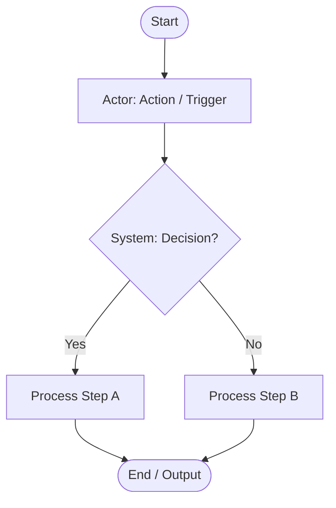

# SRS Output Template

> Reference for analyze-requirement. Loaded on-demand when creating SRS document.

## SRS Document Template

File: `docs/specs/requirements/SRS-[feature-name].md`

```markdown
# SRS: [Feature Name]
**Feature ID**: [feature-name]
**Date**: [YYYY-MM-DD]
**Author**: analyze-requirement
**Status**: DRAFT

## 1. Project Background (背景・目的)

**Background**: [なぜ必要か — What business problem or need prompted this feature?]

**Objective**: [何を達成するか — What outcome must this feature achieve?]

**Scope**: [何が含まれるか — What is in scope for this feature? What is explicitly excluded?]

## 2. Stakeholders & Actors

### Business Stakeholders
| Role | Interest / Responsibility | Approval Authority |
|------|--------------------------|-------------------|

### System Actors (Users)
| Role | Access Level | Notes |
|------|-------------|-------|

## 3. User Stories
### US-[n]: [Story title]  `[Priority: Must | Should | Could | Won't]`
- **As a** [role]
- **I want to** [action]
- **So that** [benefit]
- **Given** [precondition] **When** [action] **Then** [outcome]

> Priority scale (MoSCoW):
> - **Must** — required for launch
> - **Should** — important, include if possible
> - **Could** — nice to have
> - **Won't** — explicitly out of scope

## 4. Acceptance Criteria
| AC ID | User Story | Criterion | Test Type |
|-------|-----------|-----------|-----------|

## 5. Business Rules
| BR ID | Rule | Source |
|-------|------|--------|

## 6. Business Process Flow (業務フロー)

### Main Flow

> **Step**: Check if draw.io MCP is available by attempting `open_drawio_xml` tool call.
>
> **If draw.io MCP available (preferred)**:
> 1. Generate draw.io swimlane XML with actors as swimlane rows
> 2. Save XML to `docs/specs/diagrams/SRS-[feature]-flow.drawio`
> 3. Open with `open_drawio_xml` tool to validate
> 4. Export PNG via draw.io: ``
> 5. Add edit link: [Open in draw.io](./diagrams/SRS-[feature]-flow.drawio)
>
> **If draw.io MCP not available (Mermaid fallback)**:



### Alternative / Exception Flows
| Flow ID | Trigger Condition | Steps | Result |
|---------|------------------|-------|--------|

## 7. Data Requirements
| Field | Type | Required | Validation | Notes |
|-------|------|----------|-----------|-------|

## 8. UI Screen References
| Screen ID | Screen Name | Relevant Section |
|-----------|------------|-----------------|

## 9. System Interface Overview
> Note: Detailed API endpoint specifications belong in Basic Design (基本設計書).
> This section lists which subsystems/modules this feature must interact with.

| Interface | Direction | Purpose |
|-----------|-----------|---------|

## 10. Non-functional Requirements
- Performance: [e.g., page load < 2s, list query < 500ms]
- Security: [role-based access enforcement, data sensitivity]
- Scalability: [expected data volume, concurrent users]
- i18n: [language support requirements]

## 11. Dependencies & Risks
| Item | Type | Description | Mitigation |
|------|------|-------------|-----------|

## 12. Out of Scope
- [item]
```

---

## Constraint Compliance Check (run before Self-Review)

| Check | Rule |
|-------|------|
| API endpoint paths present? | REMOVE — belongs in BASIC spec (design-function) |
| ORM field definitions present? | REMOVE — belongs in TECH spec (design-function) |
| UI implementation details? | REMOVE — belongs in SCREEN spec (design-screen) |
| Technology choice decisions? | REMOVE — belongs in TECH spec (design-function) |
| Business rules contradict? | RESOLVE before writing — raise to the user if unresolvable |


